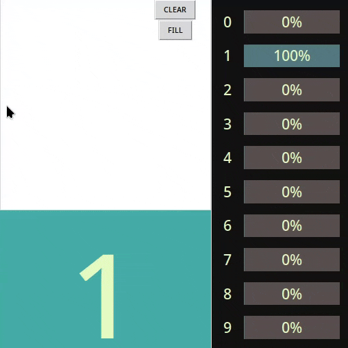

# Handwritten Digits Recognizer
A elementary Python neural network capable of recognizing handwritten digits using the MNIST dataset.

This project was built from scratch (no deep-learning frameworks) to better understand how neural networks and backpropagation work under the hood.

## MNIST Dataset
60,000 grayscale images of handwritten digits from 0 to 9, 28x28 pixels each. [1]

## Neural Network Architecture

The default neural network structure is:
- Input layer:
  - 784 neurons (one per pixel)
- Hidden layers:
  - 128 neurons
  - 30 neurons
- Output layer:
  - 10 neurons (one per digit)

The network is trained using the backpropagation algorithm, which updates weights and biases via gradient descent.

## How to run
> python3 scr/app.py

Make sure to have all requirements beforehand.

> pip install requiremets.txt

## References

[1] http://yann.lecun.com/exdb/mnist/

[2] http://neuralnetworksanddeeplearning.com/chap1.html
